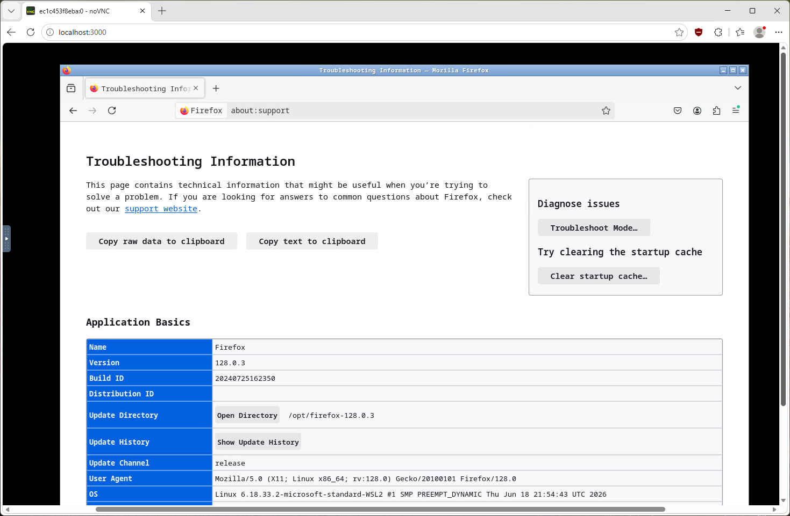

# Firefox Docker (Ubuntu 22.04 + VNC + noVNC)



A full-featured Firefox browser running inside a Docker container based on **Ubuntu 22.04 LTS**.

Access Firefox through:

- Web browser using noVNC
- Standard VNC client
- Isolated Docker environment
- Persistent Firefox profile

This project is inspired by [jlesage/docker-firefox], but uses **Ubuntu 22.04** as the base image and provides full control over Firefox versions and system packages.

---

## Features

- Ubuntu 22.04 LTS base image
- Firefox downloaded from the official Mozilla archive
- Select Firefox version during build
- Xvfb virtual display
- Openbox lightweight desktop environment
- x11vnc VNC server
- noVNC web interface
- Browser access without installing a VNC client
- Persistent Firefox profile
- Configurable timezone
- Configurable display resolution

---

## Architecture

```
Host OS
||
| http://localhost:3000
|
noVNC
|
websockify
|
x11vnc :5900
|
Xvfb :0
|
Openbox
|
Firefox

```

---

## Requirements

- Docker >= 20.x
- Docker Compose >= 2.x

Check installation:

```bash
docker --version
docker compose version
```

---

# Quick Start

Clone the repository:

```bash
git clone https://github.com/optinsoft/ubuntu22.04-firefox-docker.git
cd ubuntu22.04-firefox-docker
```

Build the image:

```bash
docker compose build
```

Start the container:

```bash
docker compose up -d
```

Open Firefox:

```
http://localhost:3000
```

---

# VNC Access

A VNC server is available on:

```
localhost:5900
```

Compatible clients:

* TigerVNC Viewer
* RealVNC Viewer
* Remmina
* Any standard VNC client

---

# Configuration

Configuration is done through the `.env` file.

Example:

```env
FIREFOX_VERSION=128.0.3
FIREFOX_LANG=en-US
TZ=Europe/London

DISPLAY_WIDTH=1920
DISPLAY_HEIGHT=1080
DISPLAY_DEPTH=24
```

---

# Firefox Version

Default version:

```
Firefox 128.0.3
```

Change Firefox version:

`.env`

```env
FIREFOX_VERSION=115.15.0esr
```

Rebuild:

```bash
docker compose build --no-cache
docker compose up -d
```

---

# Firefox Language

Set Firefox download language:

```env
FIREFOX_LANG=en-US
```

Examples:

```
en-US
ru
de
fr
```

---

# Timezone

Configure container timezone:

```env
TZ=Europe/London
```

Examples:

```
Europe/London
Europe/Berlin
America/New_York
Asia/Tokyo
```

---

# Persistent Firefox Profile

Firefox profile is stored in:

```
/config/profile
```

The following data is preserved:

* bookmarks
* cookies
* history
* preferences
* installed extensions

Removing the container does not remove profile data:

```bash
docker compose down
```

---

# Project Structure

```
firefox-docker/

├── Dockerfile
├── docker-compose.yml
├── supervisord.conf
├── start.sh
├── .env
└── README.md
```

---

# Docker Compose Example

```yaml
services:

  firefox:
    build:
      args:
        FIREFOX_VERSION: ${FIREFOX_VERSION}
        FIREFOX_LANG: ${FIREFOX_LANG}
        TZ: ${TZ}

    container_name: firefox

    ports:
      - "3000:3000"
      - "5900:5900"

    volumes:
      - ./config:/config

    restart: unless-stopped
```

---

# Container Management

Start:

```bash
docker compose up -d
```

Stop:

```bash
docker compose down
```

View logs:

```bash
docker compose logs -f
```

Restart:

```bash
docker compose restart
```

---

# Installing Firefox Extensions

Extensions can be installed normally through Firefox.

Installed extensions are stored inside:

```
./config/profile
```

and survive container restarts.

---

# Display Resolution

Change screen size using `.env`:

```env
DISPLAY_WIDTH=2560
DISPLAY_HEIGHT=1440
DISPLAY_DEPTH=24
```

Restart the container:

```bash
docker compose restart
```

---

# Security Notes

By default:

* VNC runs without authentication
* Port 5900 is exposed

For production or remote access:

* enable VNC password authentication
* use a reverse proxy
* restrict network access with firewall rules

---

# Why Ubuntu 22.04?

Advantages:

* Stable LTS base
* Large package ecosystem
* Easy customization
* Better compatibility with Linux applications

---

# License

MIT License

You are free to use, modify, and distribute this project.

---

# Credits

Inspired by:

* jlesage/docker-firefox
* noVNC
* x11vnc
* Mozilla Firefox
